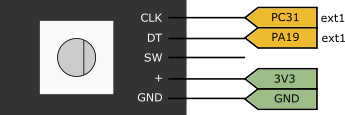

# 21b - Avaliação Prática 3

A avaliacão será off-line! Pedimos que não compartilhem e não olhem códigos deus seus colegas. Leia toda a descricão da prova antes de "sair fazendo".

O código exemplo deste repositório já possui:
    - LCD
    -
    - TC/ RTT/ RTC/ AFEC já adicionados no ASF Wizard
    - Deve utilizar o RTOS e suas funcionalidades.

:triangular_flag_on_post: **Ao finalizar a entrega preencher o formulário (uma única vez!):**

Acessar a avaliacao pelo link:

## Descrição


Nessa avaliação assíncrona vocês irão trabalhar com o LVGL e um encoder para desenvolver uma interface de um rádio automotivo. O protótipo deve usar o encoder para a seleção da frequência/ volume (conceito C>) e exibir na tela a frequência atual, além disso deve possibilitar o usuário armazenar até nove estações.

### LVGL

O código exemplo já possui a tela do LVGL montada como indicado a seguir:


#### Label

Vocês podem alterar o label do `dial` acessando diretamente o label que foi declarado como global.  

#### Botões

Todos os botões foram mapeados para o `event_handler`, nessa função de callback eu recupero qual o ID do botão apertado (`id`) e qual evento que foi detectado (`code`): 

- LV_EVENT_VALUE_CHANGED: Botão apertado
- LV_EVENT_LONG_PRESSED: Botão pressionado por um tempo maior

ATENÇÃO: quando detectado um `LV_EVENT_LONG_PRESSED` o LVGL gera também um evento de botão apertado `LV_EVENT_VALUE_CHANGED`.

> DICA RTOS: Você vai ter que colocar esses dados em uma fila para processar na task_update.

Para testar a detecção dos eventos execute o código fornecido analisando a saida do terminal (COM), e aperte ao apertar o botão 1 e soltar você deve obter algo como: 

```
ID 1: EVENT 28
```

E se apertar e segurar:

```
ID 1: EVENT 28
ID 1: EVENT 5
```

### Enconder

> Imagens extraídas do site (boa referência para vocês) https://lastminuteengineers.com/rotary-encoder-arduino-tutorial/


O enconder é um dispositivo eletromecânico que converte rotação mecânica em pulsos elétricos. Eles são muito utilizados para medir posição ou velocidade de motores e também em interfaces homem máquina de sistemas embarcados. O encoder é diferente do potenciômetro que vocês utilizaram nas outras entregas, pois ele gera um sinal DIGITAL em formato de pulsos (o pot é uma resistência elétrica variável, nós liamos ele como um sinal analógico). O enconder tem uma grande vantagem em relação ao potenciômetro: ele não tem fim de curso. É possível dar 360 com o enconder, algo que não é possível com o pot normal.

O enconder que iremos utilizar possui duas saídas: CLK (A) e DT (B) e gera pulsos distintos conforme o sentido de rotação (horário/ anti-horário), como mostrado nas figuras a seguir:

>> NOVO DADO A CADA BORDA DO SINAL CLK (A) 

- Se DT (B) != CLK (A) então houve um pulso no sentido horário


- Se DT (B) == CLK (A) então houve um pulso no sentido anti-horário


> A entrada CLK (A) serve como CLOCK da leitura do sinal, sempre que houver uma variação (0-->1/ 1-->0) fazemos a leitura do sinal DT (B) para descobrir o sentido de rotação. 

#### Ligação

Nós sugerimos a seguinte ligação do enconder com a placa:

- CLK: ligado no PC31 do EXT1  
- DT: ligado no PA19 do EXT1
- SW: desconectado 
- +: no 3v3 do kit
- GND: no terra do kit



> Os defines já estão no código.

Para ler os sinais do PC31 e PA19 vocês precisam configurar os pinos como entrada **SEM PULLUP**.

> DICA 1: Use interrupção de borda no pino do CLK (A) na do DT não é necessário
>
> DICA 2: Eu sugiro ativarem debounce nos pinos com frequência de 200Hz. Exemplo:
>
> `pio_set_debounce_filter(DT_PIO, DT_PIO_PIN_MASK, 200);`)

#### Lendo o sinal

A leitura do sinal deve ser feita no callback do pino de clock, a cada interrupção você deve obter: 

- o valor atual de CLK
- o valor atual de DT

E então fazer a lógica descrita anteriormente para identificar o sentido de rotação.

> DICA RTOS: Você vai ter que colocar a direção detectada em um fila para processar na task_update.

#### Lendo a velocidade 

Além da leitura da direção de rotação do enconder vocês terão que classificar a velocidade de rotação, a ideia aqui é que vocês terão que mudar a frequência em 0.1 Mhz se o enconder for girado de vagar e de 5.0 em 5.0 Mhz se for detectado que o usuário está girando rapidamente o botão. Para que possa varrer o range de frequências de maneira prática.

Para isso vocês terão que utilizar o RTT (como incremento ou apenas ele como relógio), calculando o dT entre os pulsos para saber se a rotacão foi rápido ou devagar.

> DICA RTOS: Envie a velocidade de rotação detectada junto com a direção na fila.

### Operação

Especificação: 

- Frequencia mínima: 77.5
- Frequencia máxima: 107.9 
- Step rotação lenta: 0.1
- Step rotação rápida: 5

Ao iniciar a aplicação todos os botões devem ter frequência associada de 77.5 Mhz, o usuário pode usando o enconder escolher uma nova frequência e se for de seu interesse armazenar a frequência associando ela a ao ID de um dos botões.

Ao apertar e segurar um dos botões (evento: LONG_PRESSED)  o sistema deve armazenar a frequência que estava sendo exibida e associar a este botão, ao apertar e soltar rapidamente um dos botões o sistema deve exibir a frequência salva nele (a padrão ou a nova).

## Rubrica

A seguir rubrica da entrega.

### C

Assista ao vídeo no youtube para ver o comportamento da máquina:

***********************************

Requisitos funcionais:

- Mudar frequência de acordo com sentido de rotação (encoder)
- Dois modos de incremento da frequência: rápido (passo de 5.0) e lento (passo de 0.1)
- Ao apertar o botão exibir a frequência salva no index do botão
- Ao apertar e segurar o botão salvar a frequência atual como padrão do botão

Requisitos técnicos:

- Só atualizar display na task_update
- Usar IRQ no CLK do encoder para leitura dos pulsos
- Usar RTT para estimar se a rotação foi do tipo rápida ou lenta
- RTOS: Usar fila para comunicar callback do clk e task_update (enviando sentido e velocidade de rotação)
- RTOS: Usar fila para comunicar handler dos botões do LVGL com a task_update (passando ID e tipo de evento)

O que não pode:

- Atualizar LCD na interrupção
- Usar variável global na interrupção 

## C+ : Novas velocidades

Criar novas categorias de velocidade para facilitar a navegação:

- Rapidão: 10 passos
- Mega rápido: 100 passos

Adicionar um buzzer ao projeto toda vez que o uma nova frequência for salva faca um barulho confirmando a acão.

## B : Volume

Usando o potenciômetro adicione o controle de volume ao projeto, além de fazer a leitura, **você deve exibir no LCD** o volume atual de forma gráfica (não pode ser apenas número).

## B+ : Relógio

Usando o RTC adicione um relógio ao LCD.

## A : Ajuste

Permita que o usuário ajuste o relógio via o encoder, para isso crie um modo de configuracão.
